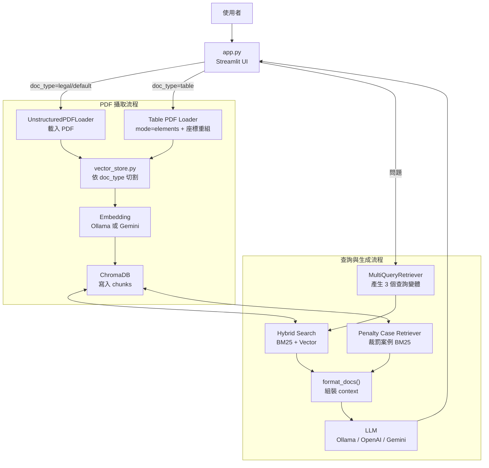
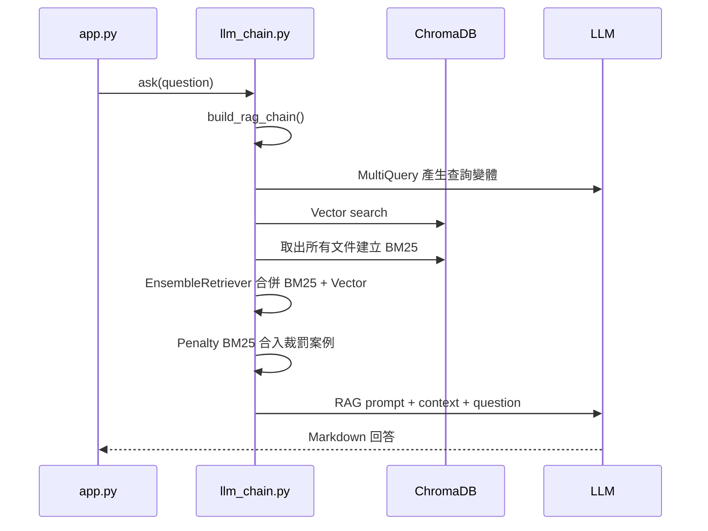

# RAG PDF 知識庫問答系統

一個針對台灣食品法規、食品標示與廣告合規審查設計的 PDF RAG 問答系統。使用者可以上傳 PDF，系統會依文件類型自動切割內容、建立 ChromaDB 向量索引，並透過 Hybrid Search 與 LLM 產生具來源依據的繁體中文回答。

## Demo 影片

[觀看 demo 影片](./product-demo.mp4)

<video src="./product-demo.mp4" controls title="RAG PDF 知識庫問答系統 Demo"></video>

## 功能特色

- PDF 上傳與知識庫建立
- 支援法規條文、統計表 / 處罰案件表、一般文件三種切割策略
- 法規文件會依章、節、條建立 contextual header，降低條文混淆
- 表格文件會針對違規廣告處罰案件表重組欄位，建立一列一案的裁罰案例 chunk
- 裁罰案例會保留產品名稱、廣告來源、違規情節、處分商號名稱、罰鍰金額、罰則註記與排名
- 結合 BM25 關鍵字搜尋、向量搜尋與 MultiQueryRetriever
- 支援 Ollama、OpenAI、Gemini 作為 LLM
- 支援 Ollama 或 Gemini Embedding
- 使用 Streamlit 提供簡潔的 Web UI
- 使用 ChromaDB 在本地持久化知識庫

## 系統架構

```text
PDF 上傳
  -> UnstructuredPDFLoader
     table 類型會使用 elements + 座標重組
  -> 文件切割 legal / table / default
  -> Embedding
  -> ChromaDB
  -> Hybrid Search: BM25 + Vector + MultiQuery
  -> 裁罰案例補強檢索
  -> LLM 生成回答
  -> Streamlit 顯示
```

詳細架構已整合於本 README 後段。

## 專案結構

```text
.
├── app.py              # Streamlit 主介面
├── config.py           # 全域設定與 .env 讀取
├── vector_store.py     # PDF 載入、切割、Embedding、ChromaDB 操作
├── llm_chain.py        # Retriever、RAG prompt、LLM chain
├── requirements.txt    # Python 套件需求
└── chroma_db/          # 本地向量資料庫，預設不提交 Git
```

## 快速開始

### 1. 建立虛擬環境

```bash
python -m venv .venv
source .venv/bin/activate
```

### 2. 安裝套件

```bash
pip install -r requirements.txt
```

### 3. 設定環境變數

建立 `.env`，內容可參考下方範例。`.env` 會包含 API key 等私密設定，預設不提交 Git。

## `.env` 範例

### Ollama 本地模式

```env
LLM_MODE=ollama
OLLAMA_BASE_URL=http://localhost:11434
OLLAMA_MODEL=llama3
MULTIQUERY_MODEL=

EMBEDDING_MODE=ollama
EMBEDDING_MODEL=bge-m3

CHROMA_PERSIST_DIR=./chroma_db
CHROMA_COLLECTION=pdf_knowledge_base

CHUNK_SIZE=1000
CHUNK_OVERLAP=200
LEGAL_CHUNK_MODE=true

RETRIEVER_K=5
PENALTY_CASE_K=25
BM25_WEIGHT=0.4
```

使用 Ollama 時，請先確認本機已啟動 Ollama，並已下載需要的模型：

```bash
ollama pull llama3
ollama pull bge-m3
```

### OpenAI 模式

```env
LLM_MODE=openai
OPENAI_API_KEY=your_openai_api_key
OPENAI_MODEL=gpt-4o-mini

EMBEDDING_MODE=ollama
EMBEDDING_MODEL=bge-m3
```

### Gemini 模式

```env
LLM_MODE=gemini
GEMINI_API_KEY=your_gemini_api_key
GEMINI_MODEL=gemini-2.0-flash

EMBEDDING_MODE=gemini
GEMINI_EMBEDDING_MODEL=gemini-embedding-001
```

## 啟動

```bash
streamlit run app.py
```

啟動後在瀏覽器開啟 Streamlit 顯示的網址，通常是：

```text
http://localhost:8501
```

## 使用方式

1. 在左側 sidebar 上傳一個或多個 PDF。
2. 選擇文件類型：
   - 法規條文：依條文邊界切割。
   - 統計表 / 處罰案件表：違規廣告處罰案件表會重組成一列一案；其他表格會保留 header 並分批切割。
   - 一般文件：使用一般字元數切割。
3. 點擊「開始攝取」建立知識庫。
4. 在主畫面輸入問題。
5. 系統會檢索相關文件片段並產生回答。

## 文件切割策略

| 類型 | 適用文件 | 說明 |
|---|---|---|
| `legal` | 法規、辦法、準則 | 偵測章、節、條、附則、附表，建立條文級 chunk |
| `table` | 違規廣告處罰案件表、裁罰案件、統計表 | 對固定欄位的違規廣告處罰案件表先用 element 座標重組，再建立一列一案的 `penalty_case`；其他表格則抽取金額案例或用 header + 行分組切割 |
| `default` | 一般 PDF | 依 `CHUNK_SIZE` 與 `CHUNK_OVERLAP` 切割 |

### 違規廣告處罰案件表

`table` 模式會特別處理欄位順序如下的 PDF 表格：

```text
項次、發文日期、產品名稱、來源、違規情節、處分商號名稱、罰鍰金額、罰則註記、排名
```

這類 PDF 常會被一般文字抽取解析成「整欄資料」而非「一列一案」。系統會使用 `UnstructuredPDFLoader(mode="elements")` 取得 element 座標，依每頁的 `項次` 位置重組資料列，再輸出一個案例一個 chunk：

```text
案例：某產品違規廣告
產品名稱：某產品
廣告來源：網站
違規情節：...
處分商號名稱：某公司
罰則註記：食品安全衛生管理法第28條第1項
罰鍰金額：80,000
排名：1
來源：公告115年1月份處理食品、健康食品違規廣告處罰案件統計表
```

`penalty_amount_text` 會保留原始罰鍰文字；`penalty_amount` 是可選的數字化欄位，只有成功解析為整數元時才會寫入。

## 重要設定

| 參數 | 預設值 | 說明 |
|---|---:|---|
| `LLM_MODE` | `ollama` | `ollama`、`openai` 或 `gemini` |
| `OLLAMA_MODEL` | `llama3` | Ollama 主生成模型 |
| `MULTIQUERY_MODEL` | 空字串 | MultiQuery 專用模型；空值代表沿用主模型 |
| `EMBEDDING_MODE` | `ollama` | `ollama` 或 `gemini` |
| `EMBEDDING_MODEL` | `bge-m3` | Ollama embedding 模型 |
| `CHUNK_SIZE` | `1000` | chunk 大小 |
| `CHUNK_OVERLAP` | `200` | 一般文件與長條文二次切割的重疊字元數 |
| `RETRIEVER_K` | `5` | 一般 retriever 候選文件數 |
| `PENALTY_CASE_K` | `25` | 裁罰案例候選文件數 |
| `BM25_WEIGHT` | `0.4` | Hybrid Search 中 BM25 的權重 |

## 常見問題

### 為什麼查不到剛上傳的 PDF？

請確認攝取流程有成功完成，且 sidebar 的「知識庫內容」有列出檔名。若 ChromaDB 狀態異常，可在 UI 中清空知識庫後重新攝取。

### 掃描版 PDF 可以用嗎？

如果 PDF 是掃描圖片，`UnstructuredPDFLoader` 可能無法取得足夠文字。建議先做 OCR，再上傳可選取文字的 PDF。

### `CHUNK_OVERLAP` 會影響表格嗎？

不會。表格模式使用 `chunk_overlap=0`，避免資料列重複造成裁罰金額或案件重複。`CHUNK_OVERLAP` 主要影響一般文件與法規超長條文的二次切割。

### 為什麼舊資料還是欄位整欄排列？

ChromaDB 內已攝取的資料不會因程式更新自動重建。若 table PDF 曾在舊版本攝取，請先在 UI 清空知識庫，再重新以「統計表 / 處罰案件表」類型上傳。

### 可以混用不同 Embedding 模型嗎？

不建議。若已用某個 embedding 模型建立知識庫，切換 embedding 模型後最好清空 `chroma_db/` 並重新攝取文件。

## 注意事項

- `.env`、`chroma_db/`、`.venv/` 預設不提交 Git。
- 本系統產生的回答應作為法規查詢與合規初步審查輔助，不應取代專業法律意見。
- 檢索品質取決於 PDF 文字解析品質、切割策略與知識庫內容完整性。
- 表格座標重組目前針對上述違規廣告處罰案件表欄位配置設計；版面大幅不同的 PDF 可能需要新增對應解析規則。

## 詳細架構

### 系統總覽



核心資料庫為本地 ChromaDB，預設目錄是 `./chroma_db`，collection 名稱是 `pdf_knowledge_base`。BM25 索引不持久化，每次查詢時從 ChromaDB 取出所有文件後在記憶體中建立。

### 模組職責

| 檔案 | 職責 |
|---|---|
| [app.py](/Users/frank/Desktop/RAG/app.py) | Streamlit 介面、PDF 上傳、文件類型選擇、攝取觸發、知識庫清空、對話顯示 |
| [config.py](/Users/frank/Desktop/RAG/config.py) | 從 `.env` 讀取 LLM、Embedding、Chroma、切割與檢索參數 |
| [vector_store.py](/Users/frank/Desktop/RAG/vector_store.py) | PDF 載入、表格重組、文件切割、Embedding 建立、ChromaDB 寫入與讀取 |
| [llm_chain.py](/Users/frank/Desktop/RAG/llm_chain.py) | LLM 建立、Hybrid Retriever、裁罰案例 Retriever、RAG prompt 與 chain 組裝 |

### 攝取流程

使用者在 sidebar 上傳 PDF 並選擇文件類型後，`app.py` 呼叫：

```python
ingest_pdf(tmp_path, display_name=uploaded_file.name, doc_type=doc_type)
```

流程如下：

1. 一般文件使用 `load_pdf()` 與 `UnstructuredPDFLoader` 將 PDF 轉成 LangChain `Document`。
2. `doc_type="table"` 時改用 `load_table_pdf()`：先以 `UnstructuredPDFLoader(mode="elements")` 取得 element 與座標，嘗試重組違規廣告處罰案件表；若重組失敗則退回一般 `load_pdf()`。
3. `split_documents()` 依 `doc_type` 選擇切割策略。
4. 每個 chunk 補上 `source_file` 與 `doc_type` metadata；`penalty_case` 內文會額外補上 `來源：<檔名不含副檔名>`。
5. `get_vector_store()` 建立 ChromaDB client 與 embedding function。
6. `db.add_documents(chunks)` 將 chunk 向量化後寫入 ChromaDB。
7. 回傳 chunk 數量給 UI 顯示。

### 法規文件切割

`legal` 模式由 `_legal_split()` 處理，目標是避免不同條文混在同一個 chunk 中。

1. `_inject_context_markers()` 掃描每一行，偵測章、節、條、附則與附表。
2. 遇到條文或附錄邊界時插入 `<<<CONTEXT:...>>>` 標記。
3. 以 `<<<CONTEXT:` 作為主要邊界，讓每一條法規盡量獨立成 chunk。
4. 超過 `CHUNK_SIZE` 的長條文再用 secondary splitter 二次切割。
5. `_enrich_chunks_with_headers()` 將 context 標記轉為可讀 header，並寫入 `chapter`、`article` metadata。

法規 chunk 範例：

```text
[第一章總則 | 第1條]
第 1 條

為加強健康食品之管理與監督，維護國民健康，並保障消費者之權益...
```

### 表格與裁罰案件切割

`table` 模式分為載入重組與切割兩段。

第一段是 `load_table_pdf()`。部分政府公告 PDF 會被一般文字抽取解析成「欄位整欄輸出」，例如先出現 `項次` 的 1、2、3，再出現 `產品名稱` 的三筆資料。這種文字順序無法直接用換行切成一列一案，因此系統會：

1. 使用 `UnstructuredPDFLoader(mode="elements")` 取得每個文字 element 的座標。
2. 依每頁左側 `項次` 的 y 座標建立 row anchor。
3. 依 x 座標判斷欄位，重組成下列欄位順序：

```text
項次、發文日期、產品名稱、來源、違規情節、處分商號名稱、罰鍰金額、罰則註記、排名
```

4. 每頁重組為 tab-separated 的 row-based `Document`，metadata 會標示：

```text
parser = "table_elements"
page = <頁碼>
```

第二段是 `_table_split()`。若 header 符合違規廣告處罰案件表，`_build_penalty_case_docs()` 會將每一列整理成一個 `doc_type="penalty_case"` chunk。

若不是違規廣告處罰案件表，系統仍會嘗試從資料列尋找罰鍰、裁罰金額、新臺幣等金額線索；找到時建立 `penalty_case`。若沒有抽到裁罰金額，則進入一般表格行分組：

1. 將第一行視為 header。
2. 以 `TABLE_CHUNK_SIZE = min(CHUNK_SIZE, 800)` 控制每個 chunk 大小。
3. 每個 chunk 都保留 header，避免資料列失去欄位語意。
4. 表格切割使用 `chunk_overlap=0`，避免重複資料列造成案例或金額誤判。

### 查詢流程

使用者輸入問題後，`app.py` 呼叫 `ask(question)`，由 `llm_chain.py` 建立 RAG chain。



查詢階段包含三種召回來源：

| 來源 | 目的 |
|---|---|
| Vector retriever | 取得語意相近的法規、案例與一般內容 |
| BM25 retriever | 強化條號、業者名稱、產品名稱、金額、關鍵詞等精確匹配 |
| Penalty case retriever | 專門從 `penalty_case` 與 `table` 文件中找出裁罰實例 |

### MultiQuery 與 Hybrid Search

`MULTI_QUERY_PROMPT` 要求 LLM 將原始問題改寫成 3 個不同搜尋查詢。這可以提高召回率，尤其適合使用者用口語問法詢問法規概念時，補上法律術語與相關同義詞。

`get_retriever()` 會先建立向量 retriever，再從 ChromaDB 取出全部文件建立 BM25 retriever。若知識庫內有文件：

```text
base_retriever = EnsembleRetriever(
    retrievers=[BM25Retriever, VectorRetriever],
    weights=[BM25_WEIGHT, 1.0 - BM25_WEIGHT],
)
```

若知識庫為空或無法建立 BM25 文件，則降級為純向量搜尋。

### 裁罰案例補強

一般 Hybrid Search 可能因語意不完全相似而漏掉表格中的實際裁罰案例，因此 `build_rag_chain()` 會額外呼叫 `get_penalty_case_retriever()`。

此 retriever 僅使用：

```text
doc_type in {"penalty_case", "table"}
```

並以 `PENALTY_CASE_K` 控制候選數。結果會和主要檢索文件合併、去重後一起送入 prompt。

### Context 格式

`format_docs()` 會保留來源、類型與裁罰金額 metadata：

```text
[文件 1 | 類型: penalty_case | 來源: 裁罰案件.pdf | 抽取罰鍰金額: 80,000 | 罰鍰金額元: 80000]
案例：某產品違規廣告
產品名稱：某產品
廣告來源：網站
違規情節：...
```

這些 metadata 會協助 LLM 在回答中填寫來源、案例與罰鍰金額。

### LLM 回答策略

`SYSTEM_PROMPT` 將問題分為三類，並強制使用對應格式。

| 類型 | 觸發情境 | 回答重點 |
|---|---|---|
| A 法規內容查詢 | 詢問條文內容、法規要求 | 法規名稱、條文原文、來源、重點說明、常見違規情境 |
| B 廣告或標示合規審查 | 詢問宣稱是否合法、是否違規、涉及廣告或標示文字 | 違規詞標注、相關法條、判罰實例、建議修改 |
| C 一般諮詢 | 不屬於 A 或 B 的問題 | 一句話摘要、詳細說明、相關法條與參考文件 |

重要約束：

- 所有回答使用繁體中文。
- 優先引用參考文件，文件不足時才補充一般法規知識。
- 法條引用必須標示來源檔名、第 X 條、第 X 項；若有款或目也要列出。
- 引用法條時必須逐字引用原文，不得只用概括說法。
- 表格只放短內容，長法條放在表格外。
- 裁罰金額只能使用參考文件中明確記載或抽取出的金額。

### Metadata 設計

所有寫入 ChromaDB 的 chunk 都會至少包含：

```text
source_file
doc_type
```

不同文件類型會額外加入 metadata：

| 文件類型 | 額外 metadata | 用途 |
|---|---|---|
| `legal` | `chapter`, `article` | 保留章節與條號，用於引用與檢索判讀 |
| `table` | `row_start` | 追蹤表格 chunk 起始資料列 |
| `penalty_case` | `row_start`, `product_name`, `media_source`, `violation_details`, `disposition_name`, `penalty_note`, `penalty_amount_text`, `penalty_amount`, `rank` | 支援判罰實例、產品名稱、廣告來源、違規情節、處分商號、罰則註記與罰鍰金額回答 |

`penalty_amount_text` 是原始罰鍰文字，應視為主要依據。`penalty_amount` 是可選整數欄位；解析失敗時不寫入，不影響檢索與回答。

### 擴充與調整

`vector_store.py` 保留 `_SPLIT_DISPATCH` 作為擴充點。新增策略時可建立新的 split function，並註冊：

```python
_SPLIT_DISPATCH["new_type"] = _new_type_split
```

UI 若要開放新類型，需同步修改 `app.py` sidebar 的 `selectbox` options。

常用召回調整方向：

| 目標 | 建議調整 |
|---|---|
| 條文漏召回 | 提高 `RETRIEVER_K`，或降低 `BM25_WEIGHT` 讓向量搜尋比重提高 |
| 條號、業者名稱、金額不準 | 提高 `BM25_WEIGHT` |
| 裁罰案例不足 | 提高 `PENALTY_CASE_K`，並確認表格 PDF 是否能被重組為一列一案；版面不同時需新增 table parser 規則 |
| 回答 context 過長 | 降低 `RETRIEVER_K` 或 `PENALTY_CASE_K` |
| chunk 過碎或過長 | 調整 `CHUNK_SIZE`；一般文件可再調整 `CHUNK_OVERLAP` |

### 已知限制

- `UnstructuredPDFLoader` 對掃描版 PDF 或複雜表格的解析品質會直接影響切割與召回結果。
- 違規廣告處罰案件表的座標重組目前針對固定欄位順序與類似版面設計：`項次、發文日期、產品名稱、來源、違規情節、處分商號名稱、罰鍰金額、罰則註記、排名`。版面大幅不同時需要新增解析規則。
- BM25 每次從 ChromaDB 取出所有文件後建立，文件量很大時查詢延遲會上升。
- 一般裁罰案件抽取仍依賴文字中可辨識的金額格式；若 PDF 將金額拆散成多欄或多行，可能需要更細的表格解析策略。
- ChromaDB collection 清空是全量操作，`delete_collection()` 不區分來源檔案。
- Prompt 要求 LLM 逐字引用條文，但最終輸出仍受檢索品質與模型遵循度影響。
