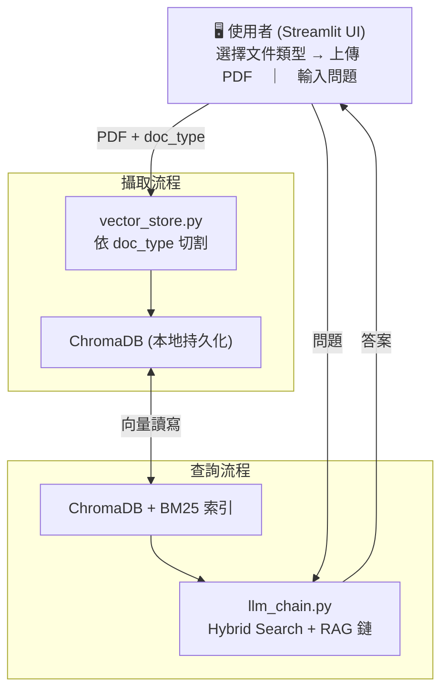

# RAG PDF 知識庫問答系統 — 架構文件

## 專案概覽

本系統是一個針對**台灣食品法規 PDF** 設計的 RAG（Retrieval-Augmented Generation）問答系統。
使用者上傳 PDF 後，系統自動依文件類型選擇切割策略建立向量索引；提問時透過 Hybrid Search 找到最相關文件片段，再由 LLM 生成結構化答案。

---

## 系統架構總覽



---

## 一、PDF 攝取流程（Ingestion Pipeline）

使用者在 sidebar 選擇**文件類型**後點擊「開始攝取」，`ingest_pdf(file_path, doc_type)` 依序執行：

```
PDF 檔案
    │
    ▼  [1] 載入
UnstructuredPDFLoader
    │  → list[Document]（PDF 純文字 + source metadata）
    │
    ▼  [2] 依 doc_type 選擇切割策略
split_documents(docs, doc_type)
    ├── "legal"   → _legal_split()    ← 法規條文（預設）
    ├── "table"   → _table_split()    ← 統計表/處罰案件表
    └── "default" → _default_split()  ← 純字元數（fallback）
    │
    ▼  [3a] 法規語意切割 _legal_split()
    │
    │  (i)  注入 CONTEXT 標記
    │       掃描每一行，遇到「第X章/節/條」或「附則/附表」時插入：
    │       <<<CONTEXT:第一章總則 | 第1條>>>
    │
    │  (ii) 以 <<<CONTEXT: 為邊界手動切割（每條嚴格獨立一個 chunk）
    │       超長條文再以 secondary_splitter 二次切割：
    │       Separator 優先：第X項 > 一、二、 > \n\n > \n > 。
    │
    │  (iii) 提取 CONTEXT → 可讀 Header
    │       <<<CONTEXT:第一章總則 | 第1條>>>
    │                  ↓ 轉換
    │       [第一章總則 | 第1條]（注入 page_content 開頭）
    │       chapter = "第一章總則"  → metadata
    │       article = "第1條"       → metadata
    │
    ▼  [3b] 表格切割 _table_split()
    │       TABLE_CHUNK_SIZE = min(CHUNK_SIZE, 800)
    │       - 第一行視為 header（欄位名稱列）
    │       - 依字元長度動態分批：batch_len + 下一行 > 800 → flush
    │       - 每個 chunk 都保留 header 列
    │       - 超長單行：safety_splitter 二次切割（overlap=0）
    │       - metadata 加入 doc_type="table" 和 row_start
    │
    ▼  [3c] 預設切割 _default_split()
    │       RecursiveCharacterTextSplitter
    │       chunk_size = CHUNK_SIZE（預設 1000）
    │       chunk_overlap = CHUNK_OVERLAP（預設 200）
    │
    ▼  [4] 加入 metadata
    │       chunk.metadata["source_file"] = 顯示檔名
    │       chunk.metadata["doc_type"]    = doc_type（若未設定）
    │
    ▼  [5] 向量化 & 存入 ChromaDB
    │       Embedding 模式由 EMBEDDING_MODE 決定：
    │       - "ollama" → OllamaEmbeddings（bge-m3 等）
    │       - "gemini" → GoogleGenerativeAIEmbeddings（gemini-embedding-001）
    │       持久化目錄：./chroma_db
    │       Collection：pdf_knowledge_base
    │
    ▼  [6] 回傳 chunk 數量 → UI 顯示成功訊息 → 1.5s 後自動清空 uploader
```

### 切割後 Chunk 樣式範例

**法規文件（legal）：**
```
page_content:
  [第一章總則 | 第1條]
  第 1 條

  為加強健康食品之管理與監督，維護國民健康，並保障消費者之
  權益，特制定本法；本法未規定者，適用其他有關法律之規定。

metadata:
  source_file: "健康食品管理法.pdf"
  doc_type:    "legal"
  chapter:     "第一章總則"
  article:     "第1條"
```

**統計表（table）：**
```
page_content:
  違規業者	產品名稱	違規宣稱	違反法規	裁罰金額    ← header 每個 chunk 都保留
  XX生技股份有限公司  護肝膠囊  具有護肝效果  健食法第14條  60,000元
  OO食品有限公司     薑黃錠    改善肝功能    健食法第14條  40,000元

metadata:
  source_file: "處罰案件統計表.pdf"
  doc_type:    "table"
  row_start:   1
```

---

## 二、查詢流程（Query Pipeline）

使用者送出問題後，`ask(question)` → `build_rag_chain()` 依序執行：

```
使用者問題：「宣稱薑黃護肝合法嗎？」
    │
    ▼  [1] MultiQueryRetriever — 擴充查詢
    │
    │  LLM 生成 3 個不同角度的子查詢：
    │  → 「薑黃護肝療效宣稱法規」
    │  → 「健康食品廣告宣稱限制」
    │  → 「食品涉及醫療效能處罰」
    │
    ▼  [2] EnsembleRetriever — Hybrid Search
    │
    │  每個子查詢同時送入兩個 retriever（各取 K=5 筆）：
    │
    │  ┌──────────────────────────────────────────────┐
    │  │  BM25Retriever (weight=0.4)                   │
    │  │  關鍵字精確匹配，適合條號、業者名稱、金額       │
    │  │                                                │
    │  │  VectorRetriever (weight=0.6)                  │
    │  │  語意相似度，適合語意模糊、同義詞問題            │
    │  └──────────────────────────────────────────────┘
    │          ↓ 多個子查詢結果取聯集去重
    │
    ▼  [3] format_docs() — 格式化 Context
    │
    │  [文件 1 | 來源: 健康食品管理法.pdf]
    │  [第一章總則 | 第2條]
    │  ...條文內容...
    │
    │  ---
    │
    │  [文件 2 | 來源: 處罰案件統計表.pdf]
    │  違規業者	產品	...
    │
    ▼  [4] RAG Prompt — 組裝最終 Prompt
    │
    │  依問題類型 A / B / C 回答：
    │  A：法規查詢 → 條文 blockquote + 重點說明 + 常見違規
    │  B：合規審查 → 違規詞表 + 判罰實例表 + 建議修改對比表
    │  C：一般諮詢 → TL;DR 摘要 + 詳細說明
    │
    ▼  [5] LLM 生成答案
    │
    │  LLM_MODE = "ollama"  → ChatOllama（本地）
    │  LLM_MODE = "openai"  → ChatOpenAI
    │  LLM_MODE = "gemini"  → ChatGoogleGenerativeAI
    │  temperature = 0（確保確定性輸出）
    │
    ▼  [6] StrOutputParser → 純文字答案 → Streamlit 顯示
```

---

## 三、模組職責

| 檔案 | 職責 |
|------|------|
| [app.py](file:///Users/frank/Desktop/RAG/app.py) | Streamlit UI、PDF 上傳（含文件類型選擇）、攝取後自動清空 uploader、對話介面 |
| [vector_store.py](file:///Users/frank/Desktop/RAG/vector_store.py) | PDF 載入、三種切割策略（legal/table/default）、ChromaDB 讀寫 |
| [llm_chain.py](file:///Users/frank/Desktop/RAG/llm_chain.py) | Hybrid Search、MultiQueryRetriever、RAG Chain 組裝、System Prompt |
| [config.py](file:///Users/frank/Desktop/RAG/config.py) | 所有參數集中管理（從 .env 讀取） |

---

## 四、關鍵設定（config.py / .env）

| 參數 | 預設值 | 說明 |
|------|--------|------|
| `LLM_MODE` | `ollama` | `ollama` / `openai` / `gemini` |
| `OLLAMA_MODEL` | `llama3` | 本地 LLM 模型名稱 |
| `OLLAMA_BASE_URL` | `http://localhost:11434` | Ollama 服務位址 |
| `OPENAI_MODEL` | `gpt-4o-mini` | OpenAI 模型名稱 |
| `GEMINI_MODEL` | `gemini-2.0-flash` | Gemini LLM 模型 |
| `EMBEDDING_MODE` | `ollama` | `ollama` 或 `gemini` |
| `EMBEDDING_MODEL` | `bge-m3` | Ollama Embedding 模型 |
| `GEMINI_EMBEDDING_MODEL` | `gemini-embedding-001` | Gemini Embedding 模型（context limit ≈ 2048 tokens） |
| `CHUNK_SIZE` | `1000` | 一般切割上限字元數；表格模式強制取 min(1000, 800)=800 |
| `CHUNK_OVERLAP` | `200` | 重疊字元數（表格模式 overlap=0） |
| `LEGAL_CHUNK_MODE` | `true` | 啟用法規語意切割（doc_type="legal" 時生效） |
| `RETRIEVER_K` | `5` | 每個 retriever 各取幾份文件 |
| `BM25_WEIGHT` | `0.4` | BM25 在 Hybrid Search 的權重（Vector 佔 0.6） |
| `CHROMA_PERSIST_DIR` | `./chroma_db` | ChromaDB 持久化路徑 |
| `CHROMA_COLLECTION` | `pdf_knowledge_base` | ChromaDB collection 名稱 |

---

## 五、Regex 邊界識別規則（法規切割用）

```python
_CHAPTER_RE  = r"第\s*[一二三四五六七八九十百千零\d]+\s*章[^\n]{0,30}"
_SECTION_RE  = r"第\s*[一二三四五六七八九十百千零\d]+\s*節[^\n]{0,30}"
_ARTICLE_RE  = r"第\s*[一二三四五六七八九十百千零\d]+(?:-\d+)?\s*條"
#                                                      ^^^^^^^
#              ↑ \s* 允許 PDF 空格格式如「第 一 章」
#                                          允許複合條號如「第 56-1 條」
_APPENDIX_RE = r"附[則表錄]"
```

---

## 六、LLM 回答格式（System Prompt 指定）

### 類型 A：法規查詢
```
### [法規名稱]

### 第 X 條（條文標題）
> 「條文原文」
> — 來源：[檔名]

**重點說明：**
- 各項要求逐點說明

**常見違規情境：**
- 哪些行為容易觸法
```

### 類型 B：廣告/標示合規性審查（三段式，不得省略）
```
### 審查宣稱
> 「使用者的宣稱」

### ⚖️ ① 法規依據
違規詞標注表格（詞彙 / 違規類型 / 🔴🟡🟢 風險等級）
+ 相關法條逐條引用

### 📊 ② 判罰實例
| # | 違規業者/產品 | 違規宣稱內容 | 違反法規 | 裁罰金額/處分 | 資料來源 |
（3～5 筆，來自統計表 PDF 的 table chunks）

### ✅ ③ 建議修改
對比表（❌ 原句 vs ✅ 建議）+ 修改原則 checklist
```

### 類型 C：一般諮詢
```
### 💬 [問題主題]

**TL;DR：** 30字內核心答案

詳細說明...
```

---

## 七、UI 流程（app.py）

```
側邊欄
  ├── 顯示目前 LLM / Embedding 模式
  ├── 📄 上傳 PDF（支援多檔，key 動態更換以支援清空）
  │     ├── 選擇文件類型：法規條文 / 統計表 / 一般文件
  │     └── 🚀 開始攝取
  │           → 逐檔處理 → 顯示 ✅/❌
  │           → time.sleep(1.5)（讓使用者看到訊息）
  │           → uploader_key += 1 → st.rerun()（清空 uploader）
  │
  ├── 📂 知識庫內容（列出已攝取的所有 source_file）
  ├── 🗑️ 清空知識庫
  └── 🔄 清空對話記錄

主畫面
  ├── 顯示對話歷史（st.chat_message）
  └── 使用者輸入 → ask() → 顯示 AI 回答
```