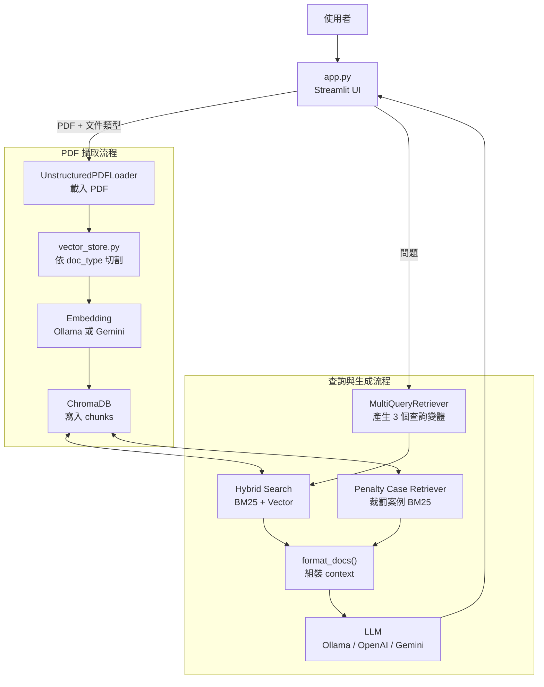
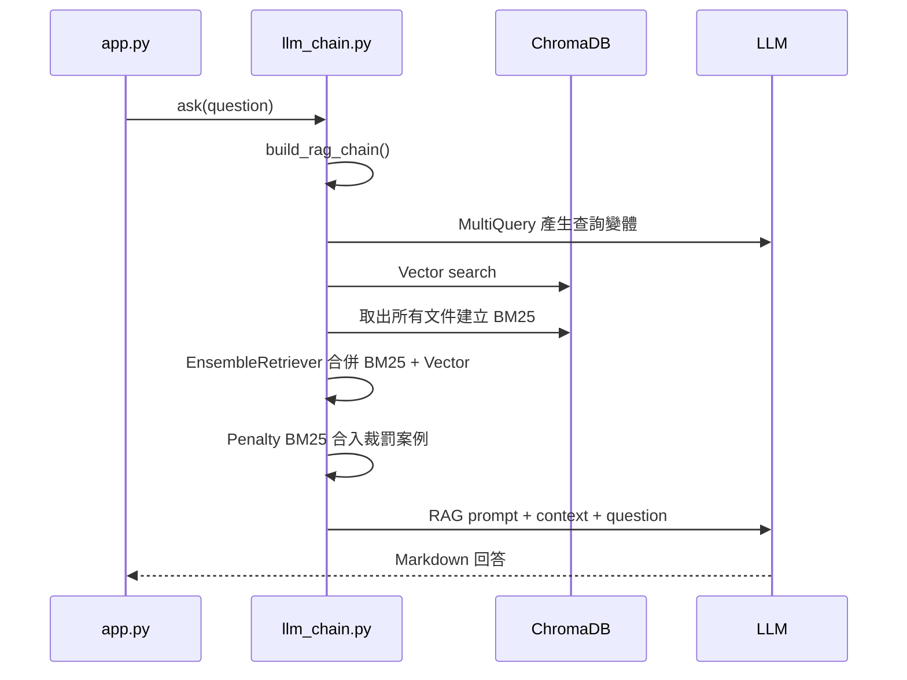

# RAG PDF 知識庫問答系統架構

本專案是一個以 Streamlit 建置的 PDF RAG 問答系統，主要服務台灣食品法規、食品標示與廣告合規審查情境。系統支援上傳 PDF、依文件類型切割內容、建立 ChromaDB 向量索引，並在提問時結合 BM25、向量搜尋、MultiQueryRetriever 與裁罰案例專用檢索，產生具來源依據的繁體中文回答。

---

## 1. 系統總覽



核心資料庫為本地 ChromaDB，預設目錄是 `./chroma_db`，collection 名稱是 `pdf_knowledge_base`。BM25 索引不持久化，每次查詢時從 ChromaDB 取出所有文件後在記憶體中建立。

---

## 2. 主要模組

| 檔案 | 職責 |
|---|---|
| [app.py](/Users/frank/Desktop/RAG/app.py) | Streamlit 介面、PDF 上傳、文件類型選擇、攝取觸發、知識庫清空、對話顯示 |
| [config.py](/Users/frank/Desktop/RAG/config.py) | 從 `.env` 讀取 LLM、Embedding、Chroma、切割與檢索參數 |
| [vector_store.py](/Users/frank/Desktop/RAG/vector_store.py) | PDF 載入、文件切割、Embedding 建立、ChromaDB 寫入與讀取 |
| [llm_chain.py](/Users/frank/Desktop/RAG/llm_chain.py) | LLM 建立、Hybrid Retriever、裁罰案例 Retriever、RAG prompt 與 chain 組裝 |

---

## 3. PDF 攝取流程

使用者在 sidebar 上傳 PDF 並選擇文件類型後，`app.py` 呼叫：

```python
ingest_pdf(tmp_path, display_name=uploaded_file.name, doc_type=doc_type)
```

流程如下：

1. `load_pdf()` 使用 `UnstructuredPDFLoader` 將 PDF 轉成 LangChain `Document`。
2. `split_documents()` 依 `doc_type` 選擇切割策略。
3. 每個 chunk 補上 `source_file` 與 `doc_type` metadata。
4. `get_vector_store()` 建立 ChromaDB client 與 embedding function。
5. `db.add_documents(chunks)` 將 chunk 向量化後寫入 ChromaDB。
6. 回傳 chunk 數量給 UI 顯示。

### 3.1 文件類型與切割策略

| `doc_type` | 使用情境 | 策略 |
|---|---|---|
| `legal` | 法規條文 | 依章、節、條、附則或附表建立上下文標記，再以條文邊界切割 |
| `table` | 統計表、處罰案件表 | 優先抽取一案一筆的裁罰案例；若無金額線索，改用表格 header + 行分組 |
| `default` | 一般文件 | 使用 `RecursiveCharacterTextSplitter` 依字元數切割 |

### 3.2 法規文件切割

`legal` 模式由 `_legal_split()` 處理，目標是避免不同條文混在同一個 chunk 中。

流程：

1. `_inject_context_markers()` 掃描每一行，偵測章、節、條、附則與附表。
2. 遇到條文或附錄邊界時插入 `<<<CONTEXT:...>>>` 標記。
3. 以 `<<<CONTEXT:` 作為主要邊界，讓每一條法規盡量獨立成 chunk。
4. 超過 `CHUNK_SIZE` 的長條文再用 secondary splitter 二次切割。
5. `_enrich_chunks_with_headers()` 將 context 標記轉為可讀 header，並寫入 `chapter`、`article` metadata。

法規 chunk 範例：

```text
[第一章總則 | 第1條]
第 1 條

為加強健康食品之管理與監督，維護國民健康，並保障消費者之權益...
```

metadata 範例：

```text
source_file = "健康食品管理法.pdf"
doc_type = "legal"
chapter = "第一章總則"
article = "第1條"
```

### 3.3 表格與裁罰案件切割

`table` 模式由 `_table_split()` 處理，分成兩層：

第一層是裁罰案件抽取。系統會在資料行中尋找罰鍰、裁罰金額、新臺幣等金額線索。若找到可解析金額，會建立 `doc_type="penalty_case"` 的文件，一案一筆，並補上：

```text
row_start
penalty_amount_text
penalty_amount
```

裁罰案例 chunk 範例：

```text
[裁罰案件]
欄位：業者 產品 宣稱 違反法規 裁罰金額
某公司 某產品 宣稱改善疾病 食品安全衛生管理法 新臺幣六萬元
抽取罰鍰金額：新臺幣六萬元
```

第二層是一般表格行分組。若沒有抽到裁罰金額，系統會：

1. 將第一行視為 header。
2. 以 `TABLE_CHUNK_SIZE = min(CHUNK_SIZE, 800)` 控制每個 chunk 大小。
3. 每個 chunk 都保留 header，避免資料列失去欄位語意。
4. 表格切割使用 `chunk_overlap=0`，避免重複資料列造成案例或金額誤判。

### 3.4 一般文件切割

`default` 模式使用：

```python
RecursiveCharacterTextSplitter(
    chunk_size=settings.CHUNK_SIZE,
    chunk_overlap=settings.CHUNK_OVERLAP,
)
```

此模式適合不具明確條文或表格結構的 PDF。`CHUNK_OVERLAP` 只影響一般切割與法規超長條文的二次切割，不影響表格模式。

---

## 4. 查詢流程

使用者輸入問題後，`app.py` 呼叫 `ask(question)`，由 `llm_chain.py` 建立 RAG chain。



查詢階段包含三種召回來源：

| 來源 | 目的 |
|---|---|
| Vector retriever | 取得語意相近的法規、案例與一般內容 |
| BM25 retriever | 強化條號、業者名稱、產品名稱、金額、關鍵詞等精確匹配 |
| Penalty case retriever | 專門從 `penalty_case` 與 `table` 文件中找出裁罰實例 |

### 4.1 MultiQueryRetriever

`MULTI_QUERY_PROMPT` 要求 LLM 將原始問題改寫成 3 個不同搜尋查詢。這可以提高召回率，尤其適合使用者用口語問法詢問法規概念時，補上法律術語與相關同義詞。

Ollama 模式下可設定 `MULTIQUERY_MODEL` 使用較輕量模型；若未設定，則沿用 `OLLAMA_MODEL`。MultiQuery 的 Ollama LLM 使用 `keep_alive=0`，降低和主生成模型同時佔用本機記憶體的風險。

### 4.2 Hybrid Search

`get_retriever()` 會先建立向量 retriever，再從 ChromaDB 取出全部文件建立 BM25 retriever。

若知識庫內有文件：

```text
base_retriever = EnsembleRetriever(
    retrievers=[BM25Retriever, VectorRetriever],
    weights=[BM25_WEIGHT, 1.0 - BM25_WEIGHT],
)
```

若知識庫為空或無法建立 BM25 文件，則降級為純向量搜尋。

### 4.3 裁罰案例補強

一般 Hybrid Search 可能因語意不完全相似而漏掉表格中的實際裁罰案例，因此 `build_rag_chain()` 會額外呼叫 `get_penalty_case_retriever()`。

此 retriever 僅使用：

```text
doc_type in {"penalty_case", "table"}
```

並以 `PENALTY_CASE_K` 控制候選數。結果會和主要檢索文件合併、去重後一起送入 prompt。

### 4.4 Context 格式

`format_docs()` 會保留來源、類型與裁罰金額 metadata：

```text
[文件 1 | 類型: penalty_case | 來源: 裁罰案件.pdf | 抽取罰鍰金額: 新臺幣六萬元 | 罰鍰金額元: 60000]
[裁罰案件]
...
```

這些 metadata 會協助 LLM 在回答中填寫來源、案例與罰鍰金額。

---

## 5. LLM 回答策略

`SYSTEM_PROMPT` 將問題分為三類，並強制使用對應格式。

| 類型 | 觸發情境 | 回答重點 |
|---|---|---|
| A 法規內容查詢 | 詢問條文內容、法規要求 | 法規名稱、條文原文、來源、重點說明、常見違規情境 |
| B 廣告或標示合規審查 | 詢問宣稱是否合法、是否違規、涉及廣告或標示文字 | 違規詞標注、相關法條、判罰實例、建議修改 |
| C 一般諮詢 | 不屬於 A 或 B 的問題 | 一句話摘要、詳細說明、相關法條與參考文件 |

重要約束：

- 所有回答使用繁體中文。
- 優先引用參考文件，文件不足時才補充一般法規知識。
- 法條引用必須標示來源檔名、第 X 條、第 X 項；若有款或目也要列出。
- 引用法條時必須逐字引用原文，不得只用概括說法。
- 表格只放短內容，長法條放在表格外。
- 裁罰金額只能使用參考文件中明確記載或抽取出的金額。

---

## 6. 重要設定

設定集中於 [config.py](/Users/frank/Desktop/RAG/config.py)，可透過 `.env` 覆蓋。

| 參數 | 預設值 | 說明 |
|---|---:|---|
| `LLM_MODE` | `ollama` | LLM 來源：`ollama`、`openai`、`gemini` |
| `OLLAMA_BASE_URL` | `http://localhost:11434` | Ollama API 位址 |
| `OLLAMA_MODEL` | `llama3` | 主生成用 Ollama 模型 |
| `MULTIQUERY_MODEL` | 空字串 | MultiQuery 專用模型；空值代表使用 `OLLAMA_MODEL` |
| `OPENAI_MODEL` | `gpt-4o-mini` | OpenAI 模型名稱 |
| `GEMINI_MODEL` | `gemini-2.0-flash` | Gemini 生成模型 |
| `EMBEDDING_MODE` | `ollama` | Embedding 來源：`ollama` 或 `gemini` |
| `EMBEDDING_MODEL` | `bge-m3` | Ollama embedding 模型 |
| `GEMINI_EMBEDDING_MODEL` | `gemini-embedding-001` | Gemini embedding 模型 |
| `CHROMA_PERSIST_DIR` | `./chroma_db` | ChromaDB 持久化目錄 |
| `CHROMA_COLLECTION` | `pdf_knowledge_base` | ChromaDB collection |
| `CHUNK_SIZE` | `1000` | 一般 chunk 大小；表格會再限制為最多 800 |
| `CHUNK_OVERLAP` | `200` | 一般文件與法規超長條文二次切割的重疊字元數 |
| `LEGAL_CHUNK_MODE` | `true` | `doc_type="legal"` 時是否啟用法規語意切割 |
| `RETRIEVER_K` | `5` | 一般 BM25 與 Vector retriever 各取的文件數 |
| `PENALTY_CASE_K` | `25` | 裁罰案例專用 BM25 候選數 |
| `BM25_WEIGHT` | `0.4` | Hybrid Search 中 BM25 權重；向量權重為 `1.0 - BM25_WEIGHT` |
| `PDF_DIR` | `./pdfs` | 預留 PDF 目錄設定，目前上傳流程使用暫存檔 |

---

## 7. Metadata 設計

所有寫入 ChromaDB 的 chunk 都會至少包含：

```text
source_file
doc_type
```

不同文件類型會額外加入 metadata：

| 文件類型 | 額外 metadata | 用途 |
|---|---|---|
| `legal` | `chapter`, `article` | 保留章節與條號，用於引用與檢索判讀 |
| `table` | `row_start` | 追蹤表格 chunk 起始資料列 |
| `penalty_case` | `row_start`, `penalty_amount_text`, `penalty_amount` | 支援判罰實例與罰鍰金額回答 |

---

## 8. 擴充點

### 新增文件切割策略

`vector_store.py` 保留 `_SPLIT_DISPATCH` 作為擴充點。新增策略時可建立新的 split function，並註冊：

```python
_SPLIT_DISPATCH["new_type"] = _new_type_split
```

UI 若要開放新類型，需同步修改 `app.py` sidebar 的 `selectbox` options。

### 新增 LLM 或 Embedding Provider

新增 LLM provider 時修改 `llm_chain.py` 的 `get_llm()` 與必要設定。新增 embedding provider 時修改 `vector_store.py` 的 `get_embeddings()` 與 [config.py](/Users/frank/Desktop/RAG/config.py)。

### 調整召回品質

常用調整方向：

| 目標 | 建議調整 |
|---|---|
| 條文漏召回 | 提高 `RETRIEVER_K`，或降低 `BM25_WEIGHT` 讓向量搜尋比重提高 |
| 條號、業者名稱、金額不準 | 提高 `BM25_WEIGHT` |
| 裁罰案例不足 | 提高 `PENALTY_CASE_K`，並確認表格 PDF 是否能被解析成含金額的文字列 |
| 回答 context 過長 | 降低 `RETRIEVER_K` 或 `PENALTY_CASE_K` |
| chunk 過碎或過長 | 調整 `CHUNK_SIZE`；一般文件可再調整 `CHUNK_OVERLAP` |

---

## 9. 已知限制

- `UnstructuredPDFLoader` 對掃描版 PDF 或複雜表格的解析品質會直接影響切割與召回結果。
- BM25 每次從 ChromaDB 取出所有文件後建立，文件量很大時查詢延遲會上升。
- 裁罰案件抽取依賴文字中可辨識的金額格式；若 PDF 將金額拆散成多欄或多行，可能需要更細的表格解析策略。
- ChromaDB collection 清空是全量操作，`delete_collection()` 不區分來源檔案。
- Prompt 要求 LLM 逐字引用條文，但最終輸出仍受檢索品質與模型遵循度影響。
